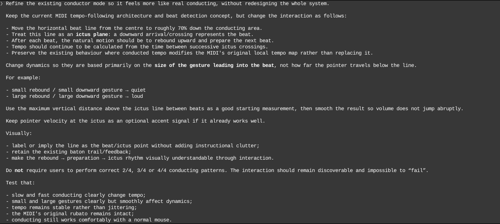

# Process overview

## What I built

I made a website that lets the user interact with a digital piano using a synthesiser for sounds and a conductor like interface to control the tempo and volume of a MIDI. The user can record a track using the keyboard/mouse and play it in conductor mode, or they can upload a MIDI or use one of the 3 preinstalled piano concerto MIDIs. The keyboard has nice visuals for the different instruments and cursor plus a modern looking UI which should be intuitive for users. 

## The moments that mattered

### 1. Moved and adjusted conductor beat bar look and feel

After playing with the site I asked Claude to edit the beat bar line where the cursor sets the tempo of the playback in conductor mode to be more intuitive and with a better feel. I first discussed change options with Claude before settling on a prompt that moved the line further down the screen and added a more responsive UI which I then verified. Instead of asking Claude to make edits with a generic prompt I used a separate Claude session to get the prompt to a state I thought would be most effective:

That produced [`f180bd5`](https://github.com/comp4020-agentic-coding-studio/comp4020-crit4-Ky787/commit/f180bd5): the beat line moved to 70% down and became an ictus plane, and dynamics switched from how far the pointer travels below the line to how high the gesture rebounds above it.

### 2. Used a curated MIDI dataset. 

I had a separate agent go through a curated dataset of MIDIs and pick out the ones that were best suited for the site (with a tempo track, instruments marked on MIDI tracks and on separate tracks) in order for the main agent not to get confused about the formatting of bad MIDI internals. Although even with the separated vetting I found 2 of the 5 tracks were not suited for conductor mode as the experience of conducting a piano solo with high variance of tempo change was not satisfying to conduct compared to the concertos. For this reason I removed them and made conducting the default with the piano concertos to choose from. 

The five vetted MIDIs went in at [`2d0767c`](https://github.com/comp4020-agentic-coding-studio/comp4020-crit4-Ky787/commit/2d0767c). Dropping the two solos back to three concertos is [`b95703d`](https://github.com/comp4020-agentic-coding-studio/comp4020-crit4-Ky787/commit/b95703d), and making conducting the mode you land in is [`66e5405`](https://github.com/comp4020-agentic-coding-studio/comp4020-crit4-Ky787/commit/66e5405).
